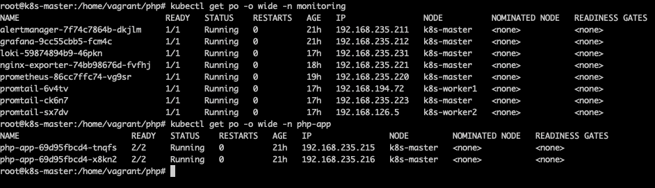
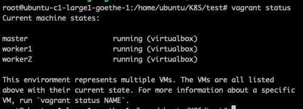
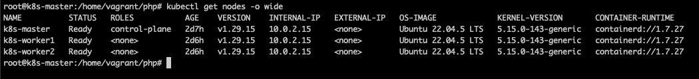
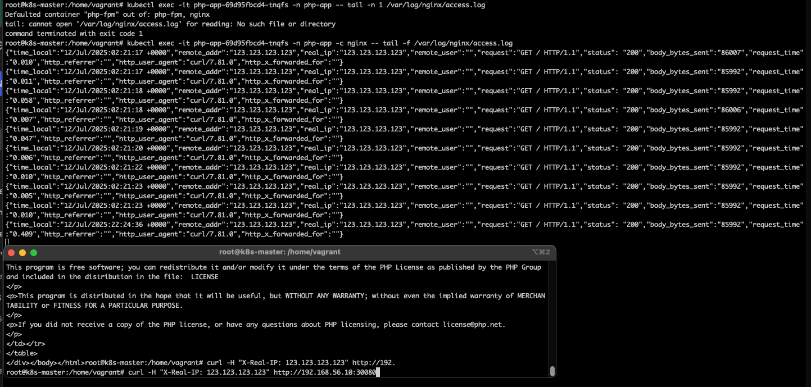
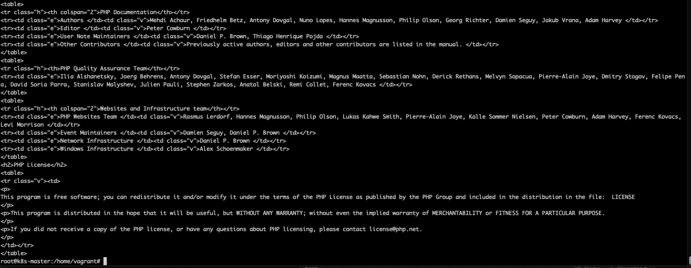
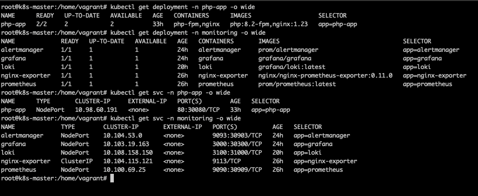

# Documents

Documents written for this project , cilick on this links

Output images of implemented task objectives.
### Task result
[Taskresult](https://docs.google.com/document/d/1-M_rz_rqhKAfu5uzmmhg6riWgcrCcwqejKINFZZyAGg/edit?tab=t.0)

Real_IP and Curl response

### RCA-Postmortem
[RCA-Postmortem](https://docs.google.com/document/d/1n8Asv4IkOsETLVRpxrXP6oKr8UJua-PHBqrG563pel4/edit?tab=t.0)

### Production Setup Guide: Design Choices and Best
[Production Setup Guide: Design Choices and Best](https://docs.google.com/document/d/1cZM0W55N8EOzXlsAR-Zqox0PJ82Ehw4vH-QI4eXlPhQ/edit?tab=t.0)

### Monitoring and Alerting Strategy Documentation
[Monitoring and Alerting Strategy Documentation](https://docs.google.com/document/d/10h_pb111MvSLejlNkNg1kEC_S6ZjrHlYGiRRAvX0gVo/edit?tab=t.0)

